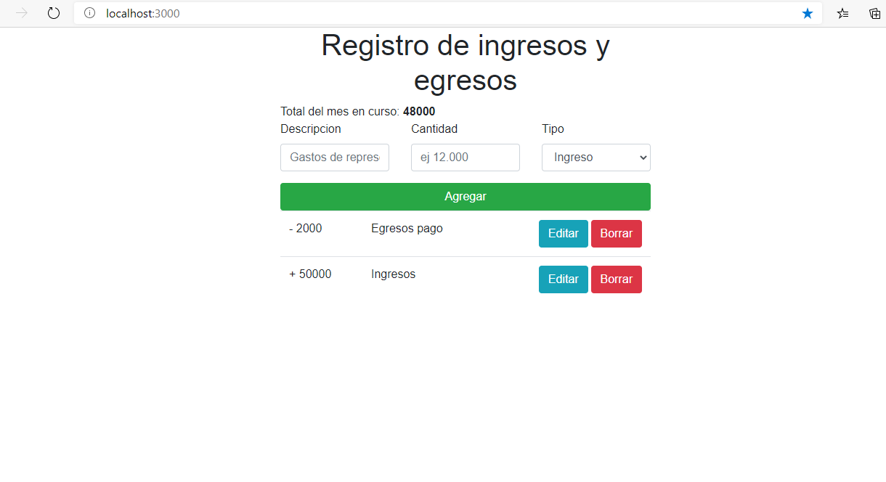
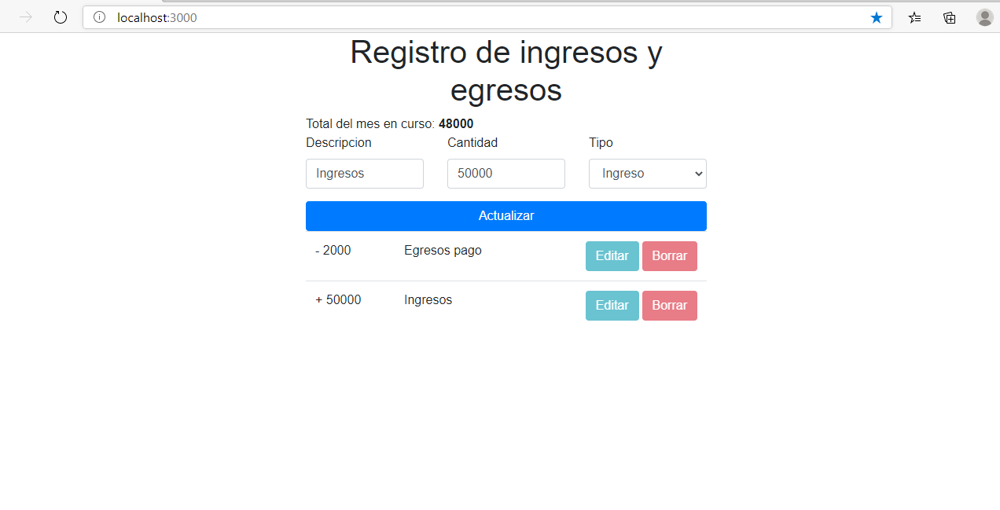

# 

#

## Configuración

clonar el repo. 

acceder a la carpeta client y ejecutar el comando `npm install`. Una vez terminado ejecutar npm start  

sobre la carpeta principal ejecutar los comando `composer install`. luego php `artisan key:generate`
sustituir .env.example por el .env configurar ambiente de bd dentro y ejecutar el comando `php artisan config:cache` para refresacar variables de ambiente. 

correr migracion con el comando `php artisan migrate` 

y levantar el servicio de laravel con el comando `php artisan serve` 

